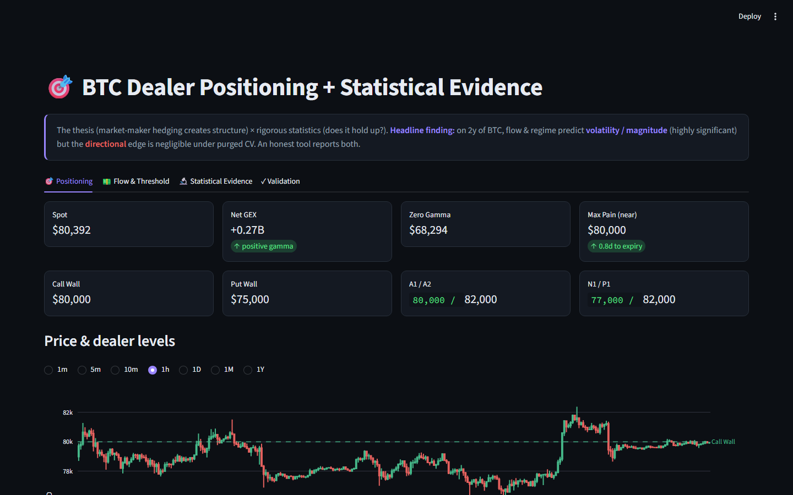
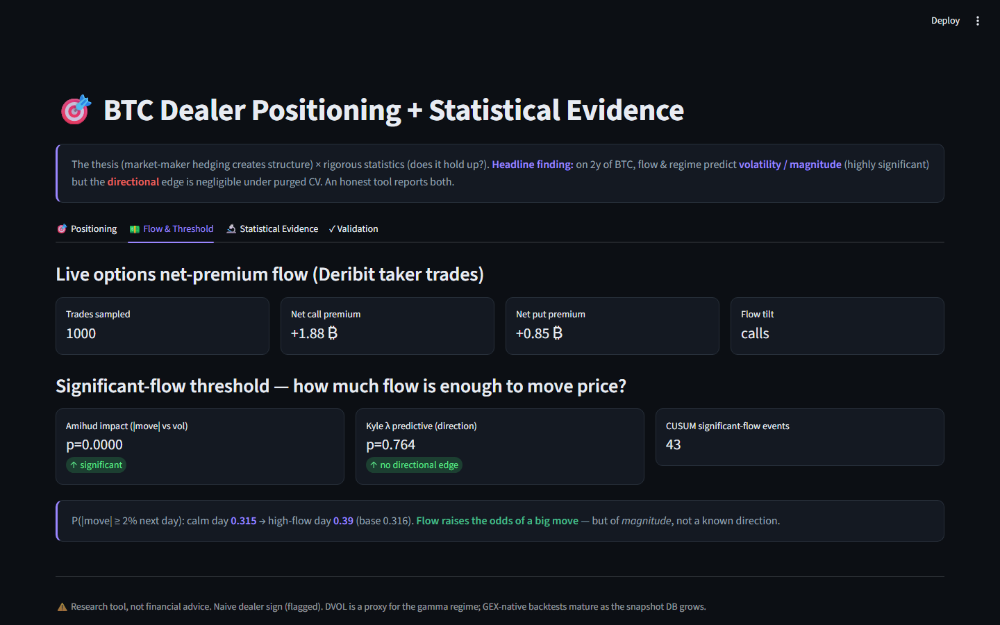
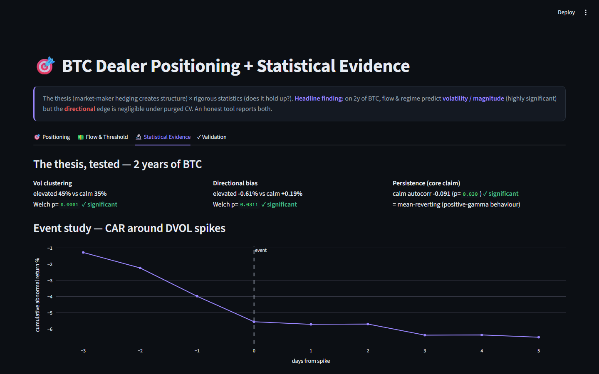
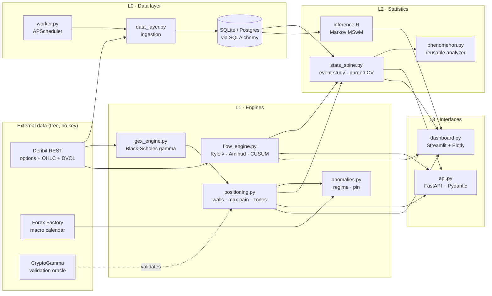

# BTC Dealer Positioning — A Rigorous Statistical Test

[](https://github.com/ItamarBenEzra78/btc-dealer-positioning/actions/workflows/tests.yml)


*A case study in doing analytics honestly: take a popular market thesis, rebuild
its metrics from raw data, test them under leakage-safe conditions, and report
exactly where they hold and where they don't — including the negative results.*

## Executive summary

- **Dataset:** 2 years of BTC options and spot data pulled from the free Deribit
  public API — **731 daily bars** (2024-07-13 → 2026-07-13) plus the full live
  option chain used to reconstruct dealer positioning.
- **Question:** Do the popular *dealer-positioning* signals — Gamma Exposure,
  gamma regimes, and options flow — actually predict BTC price behaviour, or
  only look convincing on a chart?
- **Method:** Rebuild every headline metric from scratch, then subject each
  claim to a specific statistical test: event studies, two-sample regime tests,
  Markov regime-switching (R), and a **purged/embargoed walk-forward**
  cross-validation that prevents future data from leaking into the model.
- **Main result:** The **magnitude** of price moves is statistically
  predictable (elevated-vol regimes have measurably higher forward realized
  vol, Welch p < 0.001). The **direction** of price moves is *not* — under
  leakage-safe validation, the model's Brier score (0.187) barely beats the
  base rate (0.192). The tool reports both, plainly.

> **Jargon translated on first use:** *Gamma Exposure (GEX)* — an estimate of
> how the aggregate options-book positioning of dealers may pressure them to
> hedge in the underlying market. *Max Pain* — the strike at which the most
> option contracts would expire worthless. *Purged walk-forward CV* — a
> time-series validation technique that removes any training observation whose
> forward-return window overlaps with a test observation, so tomorrow's answer
> cannot leak into today's training set.

## Dashboard preview

The Streamlit app (`dashboard.py`) unifies four views. Screenshots below were
captured from the app running locally against live Deribit data
(2026-09-06); see [`docs/screenshots/README.md`](docs/screenshots/README.md)
to reproduce them.

| View | What it shows |
|---|---|
|  | **Positioning** — live spot, Net GEX, Zero-Gamma level, Call/Put walls, Max Pain, A/P/N zones, price chart overlaid with dealer levels, live pin-condition check. |
|  | **Flow & Threshold** — net options premium flow (Deribit taker trades), Kyle λ / Amihud impact, CUSUM events, and the significant-threshold model (`P(|move|≥2%)`, calm day vs. high-flow day). |
|  | **Statistical Evidence** — the thesis tested on 2 years of BTC: vol-clustering two-sample tests, return persistence, event study of DVOL spikes, Markov high-vol regime probability, and the purged walk-forward verdict. |
| *(no screenshot — the public CryptoGamma endpoint returned HTTP 401 at capture time; the tab shows "Oracle unavailable" and degrades gracefully)* | **Validation** — the engine's outputs compared side-by-side to the CryptoGamma oracle for structural levels; sign divergences (from the naive dealer-sign convention) are flagged rather than hidden. |

**Recommended 15-second GIF:** open the app, land on **Positioning**, change
the timeframe radio from `1D` to `1M`, switch tab to **Statistical Evidence**,
scroll to the purged walk-forward verdict block. Capture with ScreenToGif
(Windows) or Kap (macOS); save as `docs/screenshots/00-tour.gif`.

## Architecture



Python for pipelines and engines; R for the one inference task where its
libraries lead (Markov regime-switching). Every statistic rides on
peer-reviewed libraries (`scipy`, `scikit-learn`, `arch`, R's `MSwM`) — only
the domain engines are hand-written.

## What this project demonstrates

**Directly built in this repository:**

- **End-to-end data ingestion** — free public APIs (Deribit REST, Forex
  Factory JSON), OHLC/DVOL history, live option-chain reconstruction, and a
  background worker that accumulates a forward snapshot database.
- **Storage & SQL** — SQLAlchemy 2.0 ORM (Declarative) behind a repository
  interface; SQLite for local development, Postgres via one env var, with no
  code changes elsewhere.
- **Statistical hypothesis testing** — Welch's t, Mann–Whitney U, Levene's
  test for variance equality, permutation tests, event studies with
  mean-adjusted cumulative abnormal returns.
- **Leakage prevention** — purged, embargoed walk-forward cross-validation
  that drops any training observation whose forward window overlaps the test
  set; scaler fitted on training folds only.
- **Probability calibration** — `CalibratedClassifierCV` (sigmoid/isotonic
  around `LogisticRegression`), Brier score against a base-rate benchmark,
  reliability curves.
- **Time-series analysis** — rolling realized volatility, regime labelling
  from implied vol, GARCH(1,1) persistence check.
- **R integration** — Markov regime-switching (`MSwM`) fitted on percent
  log-returns, smoothed regime probabilities exported for the dashboard.
- **Dashboard / BI** — Streamlit + Plotly, four themed tabs, cached queries
  with TTL, dark-mode design tokens.
- **API layer** — FastAPI with typed Pydantic response models, TTL cache to
  avoid rate-limiting Deribit, `asyncio.gather` for concurrent aggregation.
- **Reproducibility** — deterministic `now` timestamps injected from the data
  feed rather than the local clock; seeded RNG for permutation tests; a
  single `run_all.py` pipeline runner.
- **Testing** — `pytest` with 12 tests: pure-function unit tests for the
  maths plus data-backed tests that run the statistical layer against the
  committed 2-year sample.
- **Operational readiness** — `deploy/setup.sh` bootstraps a fresh Ubuntu
  VPS, plus three `systemd` units (`worker`, `api`, `dashboard`) with
  auto-restart.
- **Honest reporting of negative findings** — the directional edge is
  reported as negligible (Brier 0.187 vs. base-rate 0.192) even though hiding
  it would make the tool *look* more impressive.

**Transferable analytical principles (analogies, not equivalences):**

- **Leakage-safe validation** is a general concern in any time-ordered
  problem — market data is not product-analytics data, but the *pattern*
  of purging overlapping windows applies to churn, retention, and any
  forward-looking classification task.
- **Calibrated probabilities** matter wherever a `predict_proba` output must
  actually mean what it says — risk scoring, ranking, and A/B-test power
  analysis all depend on it.
- **Statistical significance ≠ predictive utility** — a large sample can
  make a `p < 0.01` easy to reach while the actual Brier improvement is
  0.005. Learning to distinguish the two is a habit that generalises.

## Key findings

All numbers below come from the code paths in `stats_spine.py` (Python) and
`inference.R` (R), executed on the committed 2-year sample.

| Question | Method | Result | Interpretation |
|---|---|---|---|
| Do elevated-vol regimes have different forward realized vol from calm regimes? | Welch's t + Levene | elevated **45%** vs. calm **35%**, Welch p < **0.001** | ✅ **Works** — vol clustering is real and strongly significant. |
| Do calm (positive-gamma proxy) tapes mean-revert? | lag-1 autocorrelation | calm autocorr = **−0.091**, p = **0.03** | ✅ **Works, weakly** — statistically significant but small in magnitude. |
| Do vol spikes cluster with drawdowns? | event study (CAR, ±3/±5 days) | CAR ≈ **−6.5%** around spike events | ✅ **Works** — consistent with the leverage effect. |
| Do two distinct volatility regimes exist? | Markov regime-switching (R `MSwM`) | low-vol +0.13%/day, stickiness 0.94; high-vol −0.28%/day | ✅ **Works** — two regimes fit the data. |
| Does high options flow raise the odds of a large price move? | Amihud + logistic | P(\|move\| ≥ 2% next day): 0.32 on a calm day → **0.39** on a high-flow day | ✅ **Works** — but for **magnitude**, not direction. |
| Does options flow predict the *direction* of the next move? | predictive Kyle λ + purged walk-forward CV | Kyle p = **0.76**; Brier 0.187 vs. base-rate 0.192 (edge +0.005) | ➖ **Does not work** — the directional edge is within noise under leakage-safe validation. |
| Do the reconstructed levels match a paid oracle? | side-by-side vs. CryptoGamma | Call Wall $65k = $65k; spot and Max Pain agree within tolerance | ✅ **Validated** — structural levels reconstruct correctly. |

The important row is the second-to-last: **the tool reports the negative
directional finding rather than burying it.** That is the entire point.

## Methodology in 90 seconds

The one-page technical explainer lives at
[`docs/METHODOLOGY.md`](docs/METHODOLOGY.md). It covers the hypothesis, why
naive backtesting overstates skill on options data, exactly what the purged
walk-forward is purging, which statistical tests are used and why, and the
limitations that shape the honest verdict.

## Technical stack

| Layer | Tools |
|---|---|
| **Data** | Deribit public REST (options + OHLC + DVOL), Forex Factory JSON, CryptoGamma oracle — all free, no API keys |
| **Analytics / Statistics** | `numpy`, `pandas`, `scipy`, `scikit-learn` (LogisticRegression, CalibratedClassifierCV, TimeSeriesSplit, StandardScaler, brier_score_loss, calibration_curve), `arch` (GARCH), R `MSwM` (Markov switching) |
| **Storage / SQL** | `SQLAlchemy` 2.0 (Declarative ORM), SQLite (default), Postgres (via `DATABASE_URL` env var — same code path) |
| **Visualization** | `plotly`, `streamlit` with themed dark UI |
| **Application** | `fastapi`, `pydantic`, `uvicorn`, `apscheduler` (background worker), `httpx` + `tenacity` (async + retry) |
| **Testing / Infrastructure** | `pytest`, `systemd` units, one-shot Ubuntu bootstrap script |

## Project structure

```
btc-dealer-positioning/
├── gex_engine.py         # Black-Scholes gamma; core GEX maths
├── positioning.py        # Full snapshot: max pain, walls, A/P/N zones, zero-gamma
├── flow_engine.py        # Kyle λ, Amihud, CUSUM, significant-threshold logistic
├── anomalies.py          # Vol-regime labels + max-pain pin conditions
├── calendar_layer.py     # Macro calendar catalyst context (Forex Factory)
├── stats_spine.py        # Event study · two-sample tests · purged walk-forward CV
├── phenomenon.py         # Reusable "run the full battery on any event mask"
├── inference.R           # Markov regime-switching (MSwM); optional rugarch GARCH
├── data_layer.py         # Deribit fetch + snapshot logging
├── db.py                 # SQLAlchemy ORM — SQLite default, Postgres optional
├── worker.py             # Background scheduler — captures snapshot every 30 min
├── validate.py           # Cross-check reconstructed levels vs. CryptoGamma oracle
├── api.py                # FastAPI backend with Pydantic contracts
├── dashboard.py          # Streamlit dashboard (4 tabs)
├── run_all.py            # End-to-end pipeline runner
├── net.py                # Async httpx + tenacity retry helper
├── tests/                # pytest — 12 tests, pure + data-backed
├── deploy/               # systemd units + one-shot Ubuntu setup script
├── data/                 # Committed 2y sample + generated snapshots/regime CSVs
└── docs/
    ├── METHODOLOGY.md    # 1-page technical explainer
    ├── DEPLOYMENT.md     # Streamlit Cloud + local + VPS
    └── screenshots/      # Dashboard screenshots (to be captured locally)
```

## Run locally

**Requirements:** Python 3.10+; R 4.x is *optional* (a pre-computed
`data/r_regime.csv` is committed, so the dashboard works without R).

### Quickest preview — dashboard only, from committed sample data

```bash
git clone https://github.com/ItamarBenEzra78/btc-dealer-positioning.git
cd btc-dealer-positioning
pip install -r requirements.txt
streamlit run dashboard.py
```

The dashboard fetches live positioning from the free Deribit API on start.
The **Statistical Evidence** tab reads the committed 2-year sample; the
**Validation** tab reaches out to the free CryptoGamma endpoint.

### Full pipeline — rebuild everything from scratch

```bash
# (optional) R side, for the Markov regime-switching output
Rscript -e 'install.packages(c("MSwM", "changepoint"))'

# end-to-end: builds history, logs a snapshot, runs flow model, stats, R inference,
# and validation — one command, ordered
python3 run_all.py

# then launch
streamlit run dashboard.py
```

`run_all.py` is idempotent: rerunning it refreshes the sample without wiping
anything else.

### Individual components

```bash
python3 data_layer.py     # (re)build 2y market history + log one snapshot
python3 flow_engine.py    # print flow features and significant-threshold model
python3 stats_spine.py    # print the full statistical evaluation
Rscript inference.R       # regenerate data/r_regime.csv (optional)
python3 validate.py       # compare reconstructed levels to CryptoGamma
uvicorn api:app --reload  # start the FastAPI backend at :8000 (docs at /docs)
```

### Tests

```bash
python3 -m pytest -q
```

**No API keys or secrets are required.** All data sources are free. See
[`.env.example`](.env.example) for the two optional environment variables
(`DATABASE_URL`, `SNAPSHOT_INTERVAL_MIN`).

## Deployment

See [`docs/DEPLOYMENT.md`](docs/DEPLOYMENT.md) for three deployment paths:

1. **Streamlit Community Cloud** (recruiter-friendly read-only demo).
2. **Local development** (as above).
3. **Ubuntu VPS with the collector worker** — the full production setup with
   `systemd`, documented in the existing [`deploy/DEPLOY.md`](deploy/DEPLOY.md).

## What I learned

- **Purged walk-forward CV changes the verdict.** A naive train/test split on
  overlapping forward-return windows made the directional model look far
  better than it is; embargoing the horizon between train and test brought
  the Brier improvement from "seems useful" down to +0.005 — within noise.
  Reporting the leakage-safe number is the single most important discipline
  in the project.
- **Statistical significance is not predictive skill.** The vol-clustering
  result has `p < 0.001` and the direction result has `p = 0.76`; the
  same 2-year dataset supports one and rejects the other, and both are
  correct outputs.
- **Calibration is a separate axis from accuracy.** Even after the direction
  model fails on skill, its predicted probabilities can still be checked
  against observed frequencies with a reliability curve — a habit that
  matters everywhere `predict_proba` is exposed to users.
- **Validate derived metrics against an external oracle before trusting them.**
  Reconstructing walls, Max Pain, and Zero-Gamma from raw option data is
  error-prone; cross-checking against the free CryptoGamma feed caught the
  net-gamma sign divergence early (a real dealer-sign modelling choice, not
  a bug).
- **Reporting the null is the most useful thing an analyst can do.** The
  directional negative result is *more* informative than any positive result
  the tool could produce, because it prevents an entire class of misuse
  downstream.
- **Analytical tooling only accumulates value if you also build the plumbing.**
  Free historical GEX doesn't exist; without the `worker.py` + `db.py`
  layer running unattended on a VPS, the "GEX-native backtest" I want to run
  in six months has no dataset to run against.

## Honest limitations

- **Dealer sign** uses the naive convention (long calls / short puts) — this
  is exactly why the net-gamma *sign* diverges from CryptoGamma while the
  *levels* match. Flagged, not hidden. Roadmap: a taker-flow sign model.
- **DVOL is a proxy for the gamma regime**, not the regime itself. Regime
  tests use implied vol as an observable stand-in; the true GEX-conditioned
  test needs the forward snapshot history that the collector is currently
  building.
- **GARCH in R was optional** — `rugarch` did not install cleanly on R 4.6
  during development; the Python `arch` library provides the same result,
  and the Levene test independently confirms volatility clustering (p ≈ 0.009).
- **Overlapping forward windows** make in-sample p-values optimistic; the
  purged walk-forward CV addresses this specifically for the skill check
  and is the number to trust for anything predictive.
- **Oracle availability.** The CryptoGamma public snapshot endpoint used by
  `validate.py` returned HTTP 401 on 2026-09-06; the validation row in the
  findings table reflects the original run on 2026-07-13. When the endpoint
  is unreachable the Validation tab reports "Oracle unavailable" rather than
  failing.
- **Not financial advice.** A research instrument that reports what the data
  says — including when the data says *no signal*.

## Roadmap

- [ ] Forward GEX snapshot DB → GEX-native backtests (zero-gamma break, pin rate)
- [ ] Taker-flow dealer-sign model (resolve the sign divergence)
- [ ] Macro layer (BTC-SPX regime correlation) with R `estudy2`
- [ ] Higher-order flows (Vanna / Charm exposure)
