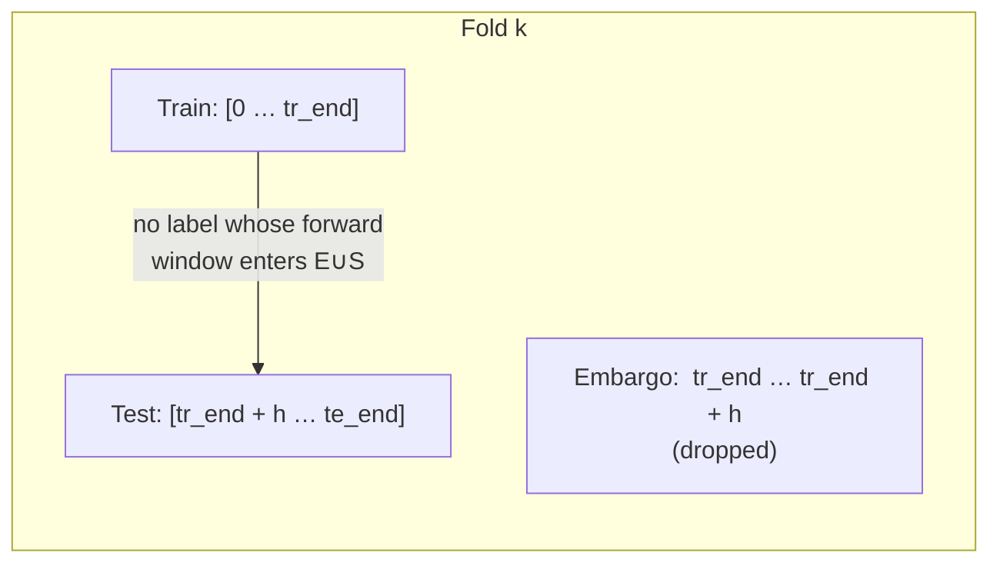

# Methodology in 90 Seconds

A one-page technical explainer of what the project tests and why the testing
setup matters more than the model choice.

## Hypothesis

The market-microstructure claim under test:

> Dealers who hedge their options-book exposure create observable pressure on
> the underlying market. When aggregate gamma exposure is *positive* (dealers
> long gamma) they hedge counter-trend and the tape becomes calmer and
> stickier; when it is *negative* they hedge with-trend and the tape becomes
> wilder. Extra-large flow events raise the odds of a large price move.

This is a specific, testable claim: it predicts differences in **forward
realized volatility**, **return autocorrelation**, and **the probability of a
large move** conditional on the observable regime and on flow.

## Data

- **Source:** Deribit public REST — free, no API key.
- **Frequency:** daily bars.
- **Window:** 2024-07-13 → 2026-07-13, **731 rows**.
- **Fields:** OHLC on BTC-PERPETUAL, Deribit's DVOL implied-volatility index,
  and the full live option chain (open interest and mark IV per strike).
- **Regime proxy:** DVOL relative to its trailing 90-day median labels each
  day as `elevated` or `calm`. This is an *observable* stand-in for the true
  dealer-gamma regime, which requires a historical GEX snapshot database that
  the collector (`worker.py`) is only now beginning to build.

## Targets / outcomes

For each day *t* we compute:

- **`fwd_ret_h`** — the log return from *t* to *t + h* for `h ∈ {1, 3, 7}`.
- **`fwd_rv_h`** — the annualised realized volatility over *t + 1 … t + h*.
- **Binary "big move"** — `|fwd_ret_h| ≥ 2%` for a fixed threshold.

## Why a naive backtest would mislead

The `fwd_ret_h` computed at day *t* depends on prices from *t + 1 … t + h*.
If the training set includes day *t* and the test set includes any of *t + 1
… t + h*, the target at *t* leaks the very prices we are trying to predict.
The classical `train_test_split` (or even a simple time-ordered split) does
not remove this overlap; a purged, embargoed walk-forward does.

## What the purged walk-forward actually purges

For `n_folds = 5` and horizon `h = 3`, each fold trains on `[0, tr_end - h]`,
throws away `h = 3` days of embargo, and tests on `[tr_end, tr_end + fold]`.
The scaler is fitted on the training slice only — no distribution information
leaks from test to train. The concatenated out-of-sample probabilities are
scored with the Brier loss against a base-rate benchmark (predict the class
mean everywhere).

## Statistical tests used

| Question | Test | Why this one |
|---|---|---|
| Do two regimes differ in mean forward vol / return? | Welch's t (unequal variance), Mann-Whitney U | Robust to non-normality; complementary parametric + non-parametric. |
| Do two regimes differ in the *variance* of forward vol? | Levene | This is the vol-clustering claim, expressed as a variance-equality test. |
| Is the observed regime difference plausible under the null? | Permutation test (10 000 shuffles) | Distribution-free robustness check. |
| Is the tape mean-reverting or trending inside each regime? | Lag-1 autocorrelation with normal-approximation p-value | Directly targets the persistence claim. |
| Do vol-spike events line up with drawdowns? | Event study — mean-adjusted cumulative abnormal returns | Standard finance-econometrics tool for around-event effects. |
| Do two distinct volatility regimes exist? | Markov regime-switching, `MSwM` in R | Formal latent-state model, not just a heuristic label. |
| Is volatility clustering strong and persistent? | GARCH(1,1) with `arch` (Python) | Standard specification; persistence = α + β. |

## Calibration and evaluation

- **Probability calibration:** `CalibratedClassifierCV` (sigmoid) wraps a
  `LogisticRegression` on standardised features; time-ordered inner splits
  via `TimeSeriesSplit`.
- **Skill vs. base rate:** Brier score against a base-rate predictor
  (`predict = base_rate everywhere`). A model beats the base rate only if its
  Brier is meaningfully smaller.
- **Reliability curve:** `sklearn.calibration.calibration_curve` on the
  out-of-sample probabilities to check that a predicted `0.4` actually
  corresponds to a `~0.4` observed frequency.

## Limitations that shape the verdict

- **DVOL is a proxy** for the gamma regime, not the regime itself. The
  cleaner test uses GEX-conditioned days — which is why the collector runs.
- **In-sample p-values on overlapping windows are optimistic.** The purged
  walk-forward CV is the number to trust for anything forward-looking; the
  in-sample tests are useful for describing the sample, not for prediction.
- **Naive dealer-sign convention** (long calls / short puts). This is why the
  reconstructed net-gamma *sign* can diverge from paid oracles while the
  *levels* match — a modelling choice that is flagged, not a bug.
- **Sample size for events is small.** The event-study CAR is stable but the
  large-move logistic depends on a limited number of `|move| ≥ 2%` days.

## The verdict in one sentence

Under the leakage-safe validation described above, the thesis's
**volatility / magnitude** predictions are supported and the **directional**
prediction is not — the model's Brier score improvement over the base rate
is +0.005, which is within noise for this sample size.
